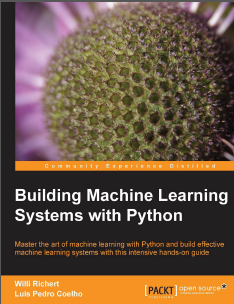

# BuildingMLSystems_packt

## iPython Notebooks of _Building Machine Learning Systems with Python_, **W. Richert** & **L.P. Coelho**

| Chapter | tbd |
| ------- | --- |
| [Getting Started with Python Machine Learning](ch01/Getting Started with Python Machine Learning.ipynb) | |
| [Learning How to Classify with Real-world Examples](ch02/Learning How to Classify with Real-world Examples.ipynb ) | |
| | |
| | |
| | |
